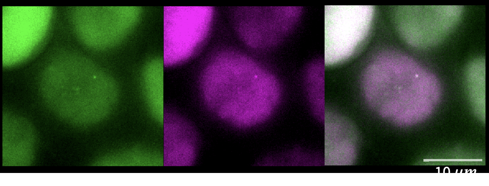

<!-- start abstract -->
# Localization_Precision_Estimation

This is a repository to analyze two color contact dynamics and estimate the localization precision from live cell imaging data

<!-- end abstract -->

## Repository Overview
* `docs`: Contains all project documentation.
* `infrastructure`: Contains detailed installation instructions for all requried tools.
* `ipa`: Contains all image-processing-and-analysis (ipa) scripts which are used for this project to generate final results.
* `runs`: Contains all config files which were used as inputs to the scripts in `ipa`.
* `scratchpad`: Contains everything that is nice to keep track of, but which is not used for any final results.

## Setup
Detailed install instructions can be found in [infrastructure/README.md](infrastructure/README.md).

## Citation
Do not forget to cite our [publication]() if you use any of our provided materials.

---
This project was generated with the [faim-ipa-project](https://fmi-faim.github.io/ipa-project-template/) copier template.
'''
snakemake -s workflows/Snakefile_cells_kristina -c 20 --configfile runs/20240809_testing_pipeline/config_file.yml
'''